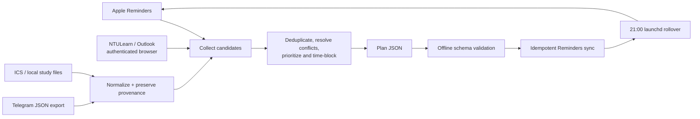

# Mac Student Planner

**A macOS-first planning skill that turns fragmented academic commitments into realistic daily and weekly plans, then keeps the actionable work synchronized with Apple Reminders.**

Students rarely have one reliable task source. Deadlines live in a learning-management system, timetable changes arrive by email, informal commitments appear in group chats, and personal work remains in Reminders. Mac Student Planner consolidates those inputs while preserving provenance, resolves conflicts explicitly, and produces a plan that includes focused work, travel, meals, recovery, and buffer time.

This repository is a [Codex skill](SKILL.md) plus a set of standalone Python command-line tools. The scripts normalize exports and automate Apple Reminders; the skill instructions coordinate authenticated web sources and planning decisions.

## What it does

| Source | Responsibility | How it contributes to the plan |
| --- | --- | --- |
| **Apple Reminders** | Reads incomplete personal tasks and acts as the execution layer for approved plans. | Existing reminders are considered before scheduling. New tasks use stable IDs, so repeated synchronization updates instead of duplicating them. Hard deadlines can be protected from automatic rollover. |
| **NTULearn** | Supplies authoritative course announcements, assignments, tests, availability windows, and deadlines. | The skill reads the relevant pages through an already authenticated browser session. Official course information overrides less authoritative sources. An ICS export is supported as a fallback. |
| **Outlook** | Supplies fixed calendar commitments and targeted school-email changes such as cancellations, location updates, and required preparation. | The skill performs read-only, date-bounded inspection through an authenticated browser. Fixed events are scheduled first; only actionable preparation or follow-up becomes a reminder. An ICS export is supported as a fallback. |
| **Telegram** | Supplies informal group-project decisions, meeting proposals, and last-minute notices. | Telegram Desktop JSON exports are normalized with chat, message ID, and timestamp provenance. Ambiguous or informal items are marked for confirmation instead of being treated as authoritative deadlines. |

Local Markdown, text, JSON, CSV, TSV, and ICS files can also be scanned as a private supplementary source. They are useful for study checklists and course material stored in OneDrive or another local directory, but are intentionally kept outside the public repository.

After collection, the planner:

1. normalizes candidate records and retains their source metadata;
2. separates fixed events from flexible tasks;
3. resolves duplicates and exposes conflicting dates or locations;
4. selects at most three important outcomes per day;
5. adds focused blocks, meals, travel, rest, and at least 20% buffer capacity;
6. validates the approved plan as JSON; and
7. creates or updates only planner-managed Apple Reminders.

## Architecture

```text
agents/       Codex skill interface metadata and the default invocation prompt
scripts/      Importers, plan validation, Reminders synchronization, and launchd automation
references/   Source-routing rules and the normalized plan schema
tests/        Offline unit tests for parsing, validation, provenance, and launch scheduling
assets/       Public, sanitized configuration and plan examples
SKILL.md      End-to-end planning workflow, safety rules, and planning heuristics
```

### Data flow



The normalization scripts emit **candidate records**, not final commitments. Planning remains a separate step so that an informal Telegram message cannot silently override an official deadline. Every final task carries a provider, source label, optional external ID, and optional URL or local path.

### Main components

- [`scripts/reminders.py`](scripts/reminders.py) — validates plan JSON and reads, creates, updates, or rolls over Apple Reminders through JXA and `/usr/bin/osascript`.
- [`scripts/import_ics.py`](scripts/import_ics.py) — parses a practical subset of iCalendar `VEVENT` and `VTODO` records.
- [`scripts/import_telegram.py`](scripts/import_telegram.py) — flattens Telegram Desktop JSON exports and applies chat/date filters.
- [`scripts/import_local.py`](scripts/import_local.py) — performs a read-only scan of supported local study files, skipping symlinks and hidden paths.
- [`scripts/launchd.py`](scripts/launchd.py) — previews, installs, inspects, and removes the macOS LaunchAgent used for evening rollover.
- [`references/plan-schema.md`](references/plan-schema.md) — defines the stable task contract consumed by the Reminders synchronizer.

## Requirements

- macOS for Apple Reminders synchronization and `launchd` automation
- Python **3.10 or newer**; the current repository is verified with Python 3.14
- Apple Reminders enabled on the Mac
- Automation permission for the terminal or Codex host to control Reminders
- An already authenticated browser session for live NTULearn or Outlook inspection
- Codex when using the complete agent-driven planning workflow

The Python tools use only the standard library. There is no `pip install` step and no external Python SDK dependency.

## Installation

```bash
git clone https://github.com/FelixZhang12138/mac-student-planner.git
cd mac-student-planner

python3 --version
python3 scripts/reminders.py doctor
python3 -m unittest discover -s tests -v
```

For local configuration, copy the public template and edit only the private copy:

```bash
cp assets/config.example.json config.json
```

`config.json` is ignored by Git. Use it to select a timezone, dedicated Reminders list, rollover time, and private local-source directory. Do not put passwords, session cookies, MFA codes, or API tokens in this file.

CLI flags take precedence over environment variables and `config.json`. For scripts that accept a timezone, the resolution order is:

```text
--timezone → MAC_STUDENT_PLANNER_TIMEZONE → config.json → UTC
```

The public example uses `Asia/Singapore` for an NTU workflow; it is not hard-coded into the importers.

To make the checkout available as a personal Codex skill, place or symlink the repository at:

```text
$CODEX_HOME/skills/mac-student-planner
```

If `CODEX_HOME` is unset, Codex normally uses `~/.codex`.

## Usage

### 1. Check macOS prerequisites

```bash
python3 scripts/reminders.py doctor
```

The first live Reminders read or write may trigger a macOS permission prompt. Grant access under **System Settings → Privacy & Security → Automation**.

### 2. Normalize optional exports

```bash
# NTULearn or Outlook calendar export
python3 scripts/import_ics.py \
  --input /absolute/path/calendar.ics \
  --provider ntulearn \
  --timezone Asia/Singapore \
  --output /tmp/calendar-records.json

# Telegram Desktop export
python3 scripts/import_telegram.py \
  --input /absolute/path/result.json \
  --since 2026-08-01 \
  --chat "course group" \
  --output /tmp/telegram-records.json

# Private local/OneDrive study directory configured in config.json
python3 scripts/import_local.py \
  --timezone Asia/Singapore \
  --output /tmp/local-records.json
```

For live NTULearn and Outlook data, invoke the skill in Codex and sign in directly in the browser if necessary. The skill never asks for or stores the credentials.

### 3. Build and validate a plan

Start with the sanitized example:

```bash
cp assets/plan.example.json /tmp/student-plan.json
python3 scripts/reminders.py validate --plan /tmp/student-plan.json
```

The full task schema, including provenance, priority, and rollover protection, is documented in [`references/plan-schema.md`](references/plan-schema.md).

### 4. Preview and synchronize

```bash
# Read-only with respect to writes, but it reads the live Reminders database
python3 scripts/reminders.py sync \
  --plan /tmp/student-plan.json \
  --list "Student Plan" \
  --dry-run

# Apply after reviewing the plan and dry-run counts
python3 scripts/reminders.py sync \
  --plan /tmp/student-plan.json \
  --list "Student Plan"
```

Each synchronized item receives a marker such as `[mac-student-planner:id=manual-example-review]`. Reusing the same task ID updates that reminder rather than creating another copy. The tool never deletes reminders or marks them complete.

### 5. Configure the 21:00 evening rollover

```bash
python3 scripts/launchd.py print --hour 21 --minute 0 --list "Student Plan"
python3 scripts/launchd.py install --hour 21 --minute 0 --list "Student Plan"
python3 scripts/launchd.py status
```

The job moves only managed, incomplete reminders due that day or earlier. Tasks marked with `"rollover": false` keep their original deadline and overdue state.

Remove the automation with:

```bash
python3 scripts/launchd.py uninstall
```

## Example: one task from input to Reminders

Given this approved plan input:

```json
{
  "schema_version": 1,
  "generated_at": "2026-08-11T20:00:00+08:00",
  "timezone": "Asia/Singapore",
  "period": {
    "kind": "daily",
    "start": "2026-08-12",
    "end": "2026-08-12"
  },
  "tasks": [
    {
      "id": "manual-example-review",
      "title": "Review tomorrow's top three priorities",
      "due_at": "2026-08-12T09:00:00+08:00",
      "notes": "Write three measurable outcomes before starting work.",
      "priority": 5,
      "rollover": true,
      "source": {
        "provider": "manual",
        "label": "Daily review"
      }
    }
  ]
}
```

Offline validation produces JSON in this shape:

```json
{
  "ok": true,
  "valid": true,
  "plan": "/tmp/student-plan.json",
  "task_count": 1
}
```

On the first live synchronization, the result has this shape:

```json
{
  "ok": true,
  "list": "Student Plan",
  "created": 1,
  "updated": 0,
  "skipped": 0,
  "dry_run": false,
  "list_would_be_created": false
}
```

Running the same plan again reports one update instead of creating a duplicate. In the complete workflow, the daily or weekly plan can contain source-backed tasks from NTULearn, Outlook, Telegram, local files, and existing Reminders; fixed events and protected recovery blocks remain in the human-readable plan rather than becoming noisy reminders.

## Technical stack

- **Language:** Python 3.10+
- **Python dependencies:** standard library only (`argparse`, `json`, `zoneinfo`, `plistlib`, `subprocess`, `unittest`, and related modules)
- **macOS automation:** JavaScript for Automation (JXA) executed by `/usr/bin/osascript`
- **Scheduling:** macOS `launchd` LaunchAgent
- **Data formats:** JSON, iCalendar/ICS, Telegram Desktop JSON export, Markdown, text, CSV, and TSV
- **External interfaces:** Apple Reminders scripting interface; authenticated NTULearn and Microsoft Outlook web sessions; Telegram Desktop export format
- **Testing:** Python `unittest` with mocks for platform-specific automation

No NTULearn, Microsoft, or Telegram private API is called directly, and no browser session token is read or persisted by the repository.

## Safety and privacy

- Live plans, normalized exports, logs, ICS files, Telegram exports, and `config.json` are excluded by `.gitignore`.
- Web sources are read-only unless the user separately requests an external write.
- Content from email, course pages, messages, and local files is treated as untrusted data rather than agent instructions.
- Stable IDs constrain synchronization to planner-managed reminders.
- Hard deadlines can opt out of rollover with `rollover: false`.
- The synchronizer never deletes source data or completes reminders.

See [`SECURITY.md`](SECURITY.md) for credential handling, supported security boundaries, and private vulnerability reporting.

## Known limitations and roadmap

- Apple Reminders and `launchd` integration require macOS; only validation and importers are portable.
- Live NTULearn and Outlook collection depends on an existing authenticated browser session and is orchestrated by the Codex skill rather than a headless API client.
- The bundled ICS parser does not expand recurring rules into every occurrence; important recurring events should be verified against the live calendar.
- Telegram messages can contain incomplete or ambiguous dates and require confirmation before scheduling.
- Local file import supports structured text formats but does not extract PDF, PowerPoint, or Word content.
- There is currently no graphical interface, database, or background web service.
- Future work: broader parser edge-case coverage, richer conflict scoring, configurable planning policies, and an end-to-end macOS integration test harness.

## Development

Run the complete offline test suite and byte-compile the scripts:

```bash
python3 -m unittest discover -s tests -v
python3 -m compileall -q scripts tests
```

When changing a normalized record or plan field, update the corresponding contract in `references/` and add an offline regression test. Keep fixtures sanitized and never commit a real course export or private plan.

## License

[MIT](LICENSE)
